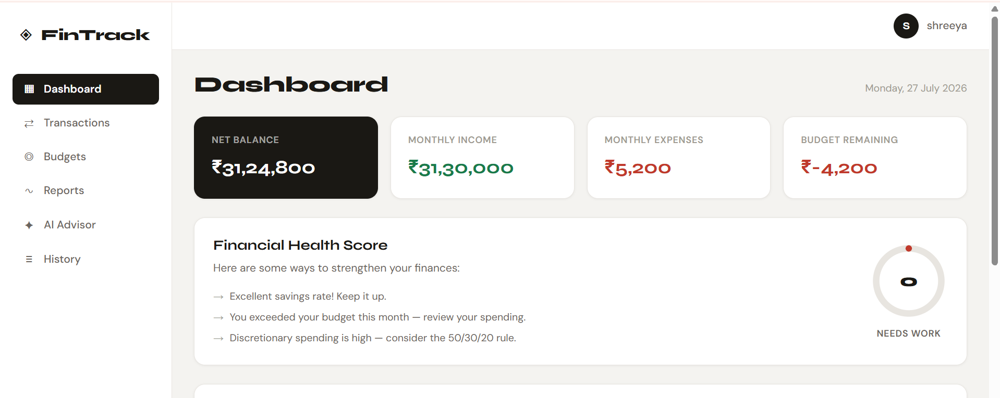
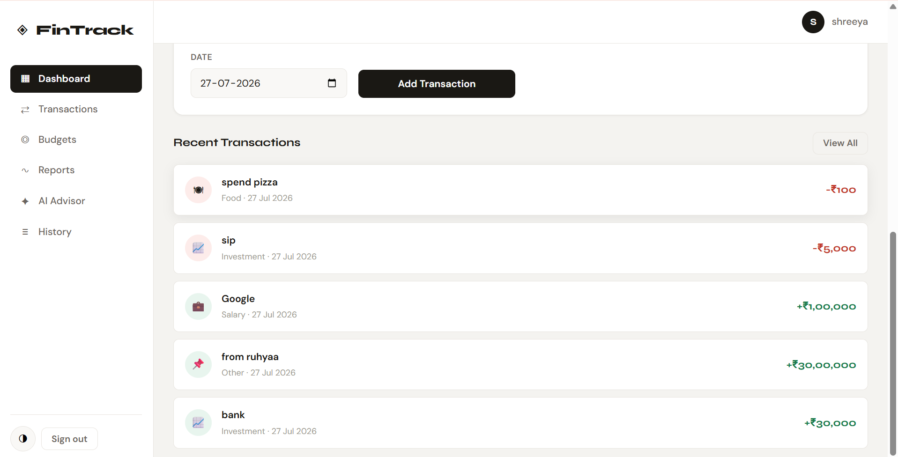
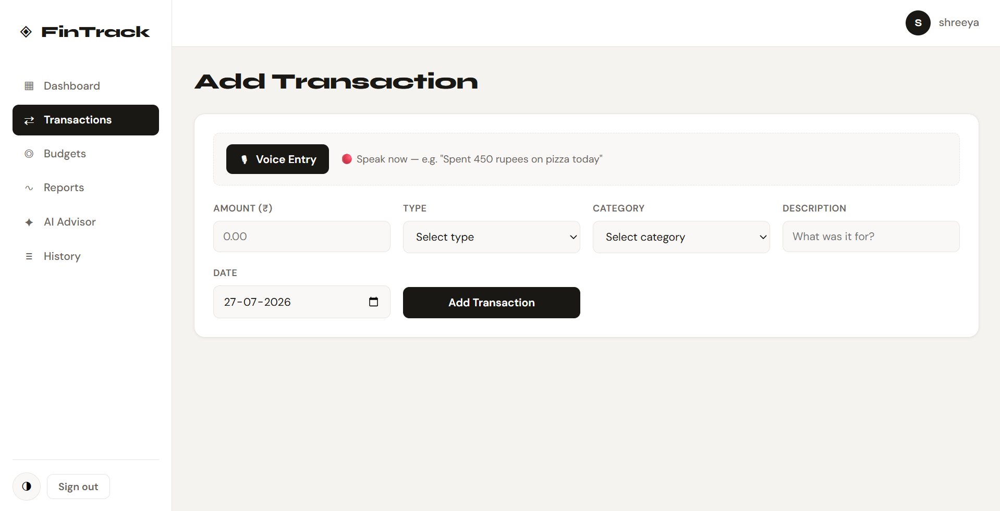
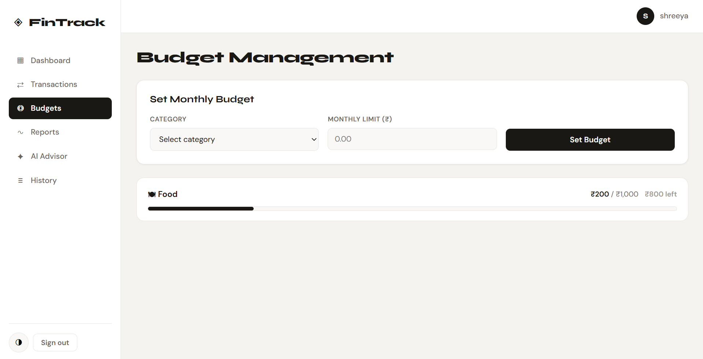
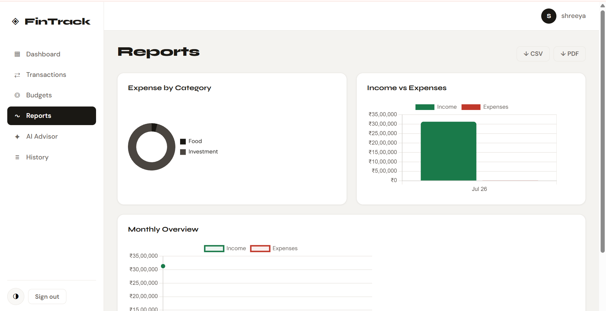
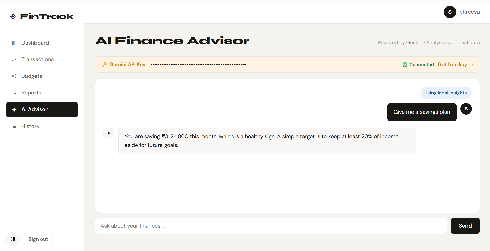
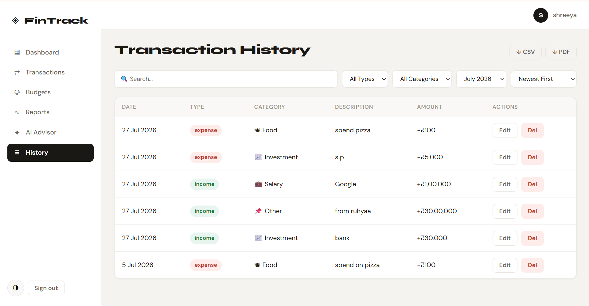

# 💰 Budget Tracker with AI Financial Assistant

A modern and interactive **Personal Budget Tracker** built using **HTML, CSS, and JavaScript**. The application helps users efficiently manage their income, expenses, savings, and monthly budgets while providing **AI-powered financial insights** using Google's Gemini API.

This project was developed to strengthen frontend development skills by implementing real-world financial management features with an intuitive user interface and AI integration.

---

# 📖 About the Project

Managing personal finances can become difficult without proper tracking and analysis. This Budget Tracker simplifies expense management by allowing users to record transactions, monitor their spending habits, and visualize their financial health.

The application also integrates **Google Gemini AI**, enabling users to receive personalized financial suggestions, budgeting advice, and money-saving recommendations based on their financial data.

---

# 🎯 Project Objectives

- Build a responsive finance management application using JavaScript.
- Learn DOM manipulation and event-driven programming.
- Implement CRUD operations for financial transactions.
- Practice Local Storage for data persistence.
- Visualize financial information using charts.
- Integrate Google's Gemini AI API.
- Improve user experience through interactive dashboards.

---

# ✨ Features

## 💵 Transaction Management

- Add income and expense transactions
- Edit existing transactions
- Delete transactions
- Categorize expenses
- Maintain complete transaction history

---

## 📊 Dashboard

- Total Income
- Total Expenses
- Current Balance
- Financial Summary
- Recent Transactions

---

## 💰 Budget Management

- Set monthly budget
- Track spending against budget
- Budget utilization indicator
- Remaining budget calculation

---

## 📈 Reports & Analytics

- Expense analysis
- Income vs Expense comparison
- Interactive financial charts
- Spending overview

---

## 🤖 AI Financial Assistant

Using Google's Gemini API, users can:

- Receive personalized budgeting advice
- Analyze spending habits
- Get saving recommendations
- Improve financial planning
- Ask finance-related questions

---

## 📱 Responsive User Interface

- Modern layout
- Mobile-friendly design
- Easy navigation
- Interactive components
- Clean dashboard

---

# 🚀 Getting Started

## Prerequisites

Before running the project, ensure you have:

- A modern web browser (Chrome, Edge, Firefox, etc.)
- Visual Studio Code (recommended)
- Live Server extension (recommended)
- A Google Gemini API key

---

## Installation

### 1. Clone the repository

```bash
git clone https://github.com/shreeya023/Fintrack-Budget-Tracker.git
```

### 2. Open the project

Open the project folder in Visual Studio Code.

### 3. Configure the Gemini API

Generate your own Gemini API key from **Google AI Studio**.

Add your API key to the application's configuration where the Gemini API is initialized.

> **Note:** For security reasons, API keys are not included in this repository.

### 4. Run the application

Launch the project using the **Live Server** extension or open `index.html` in your browser.

The application is now ready to use.

# 📸 Screenshots

## Dashboard



>

---

## Transaction Management



---

## Budget Overview



---

## Financial Reports


---

## AI Financial Assistant



---
## History


# 🧠 Working Flow

1. User enters income and expenses.
2. Transactions are stored in browser Local Storage.
3. Dashboard updates automatically.
4. Charts visualize financial information.
5. User interacts with the AI Financial Assistant.
6. Gemini API generates personalized financial advice.

---
